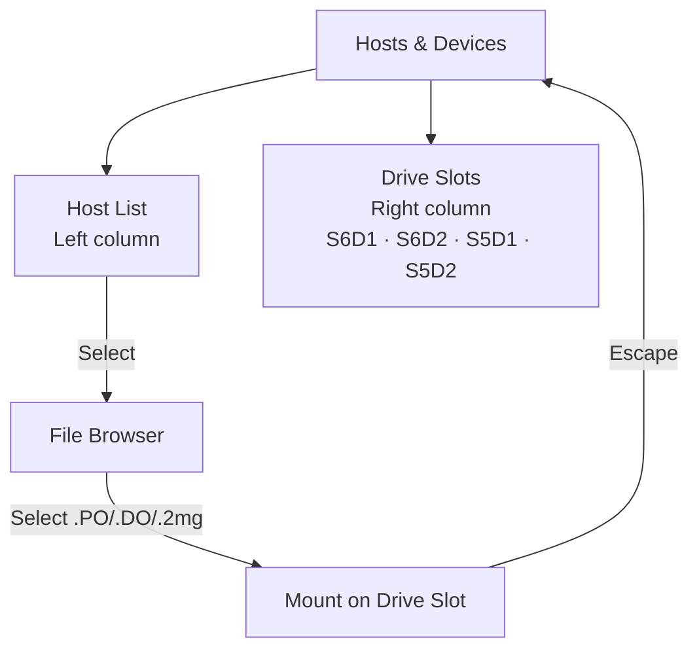

# Using CONFIG: Apple II

CONFIG on the Apple II is a native ProDOS-compatible application that uses standard Apple II keyboard conventions.

## Launching CONFIG

| Method | How |
|---|---|
| Automatic | FujiNet presents the CONFIG disk on boot — it loads automatically |
| Physical button | Press the CONFIG button on the FujiNet device to reload CONFIG |
| From ProDOS | Run the `CONFIG` executable from the FujiNet volume |

## Keyboard reference

| Key | Action |
|---|---|
| Arrow keys or `I/J/K/M` | Navigate menus |
| `Return` | Select / confirm |
| `Escape` | Go back / cancel |
| `Delete` | Erase character in text field |
| `Tab` | Next field |
| `Ctrl+R` | Reboot / reset |

## Main menu

```
┌─────────────────────────────────────┐
│        FujiNet CONFIG               │
│                                     │
│  1  Hosts & Devices                 │
│  2  Network                         │
│  3  Printer                         │
│  4  Clock                           │
│  5  System Info                     │
│  6  Quit                            │
│                                     │
│  FW: 1.5  IP: 192.168.1.42         │
└─────────────────────────────────────┘
```

## Screen 1: Hosts & Devices

Works identically to the Atari version conceptually, adapted for Apple II disk formats:



**Supported image formats:**

| Extension | Description |
|---|---|
| `.PO` | ProDOS order disk image |
| `.DO` | DOS 3.3 order disk image |
| `.DSK` | Generic disk image (order determined by content) |
| `.2MG` | 2IMG format (includes metadata) |
| `.HDV` | Hard disk volume image |

**Drive slots:**

| Slot | Description |
|---|---|
| S6D1 | Slot 6, Drive 1 (primary boot disk) |
| S6D2 | Slot 6, Drive 2 |
| S5D1 | Slot 5, Drive 1 (SmartPort) |
| S5D2 | Slot 5, Drive 2 (SmartPort) |

## Screen 2: Network

Same as other platforms — scan for Wi-Fi networks and enter credentials.

## Screen 3: Printer

Configure FujiNet's printer emulation for Apple II:

| Setting | Options |
|---|---|
| Emulation type | ImageWriter, Epson MX-80, Generic |
| Output | PDF to SD card or network PDF server |

## Screen 4: Clock

FujiNet provides the current date/time via ProDOS clock driver:
- Any ProDOS application that reads the system clock gets the correct time.
- Set your timezone offset in the Clock screen.

## Popular TNFS servers for Apple II

| Server | Contents |
|---|---|
| `tnfs.fujinet.online` | Official community server |
| `apple2.irata.online` | Apple II software archive |
