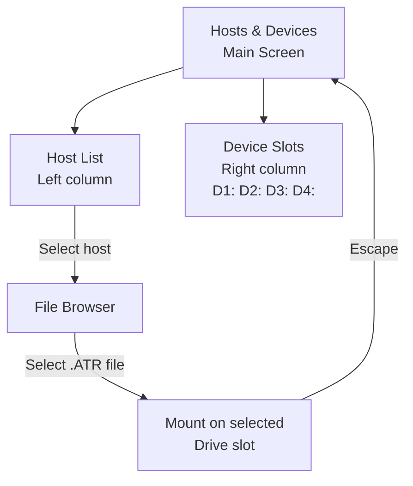

# Using CONFIG: Atari 8-bit

CONFIG on the Atari 8-bit is a native Atari application that uses the standard Atari keyboard and joystick conventions. It runs in graphics mode 0 (40-column text).

## Launching CONFIG

| Method | How |
|---|---|
| Automatic (no boot disk) | Power on — CONFIG loads if no other disk is configured |
| Force CONFIG on next boot | Hold the **button on FujiNet** for 2 seconds |
| From BASIC | CONFIG is not directly callable from BASIC; use the button method |
| At boot | Hold **`Option`** while powering on to access CONFIG menu |

## Keyboard reference

| Key | Action |
|---|---|
| Arrow keys | Move cursor / navigate menus |
| `Return` | Select / confirm |
| `Escape` | Go back / cancel |
| `Delete` | Delete a character (in text fields) |
| `Tab` | Move to next field |
| `Start` | Quick-mount a disk on D1: |
| `Option` + power | Boot into CONFIG |

## Main menu layout

```
┌─────────────────────────────────────┐
│         FujiNet CONFIG              │
│                                     │
│  1. Hosts & Devices                 │
│  2. Network                         │
│  3. Printer                         │
│  4. Clock                           │
│  5. System Info                     │
│  6. Reboot                          │
│                                     │
│  FW: 1.5  IP: 192.168.1.42         │
└─────────────────────────────────────┘
```

## Screen 1: Hosts & Devices

This is the main screen you'll use to mount disk images.



**Host column** (left) — lists configured TNFS servers and the SD card:
- `SD:` — your microSD card
- `tnfs.fujinet.online` — official community TNFS server
- Additional hosts you've added

**Device column** (right) — shows drive slots D1: through D8::
- Displays the currently mounted image filename
- Highlight a slot, then select a file from the host column to mount it

### Mounting a disk image step by step

1. Use **arrow keys** to highlight a host in the left column.
2. Press **Return** to open the file browser for that host.
3. Navigate directories with arrow keys; press **Return** to enter a folder.
4. Highlight a `.ATR` file and press **Return** — you'll be asked which drive slot.
5. Press a number (`1`–`8`) to assign to D1:–D8:.
6. The image name appears in the device slot column.
7. Press **Escape** to return to the main menu, then **Escape** again to exit CONFIG.
8. **Cold boot** your Atari (hold Reset briefly) to boot the mounted image.

!!! tip "Quick-mount to D1:"
    Highlight a file and press **`Start`** to immediately mount it on D1: and reboot.

### Ejecting a disk

1. In Hosts & Devices, highlight the drive slot (right column).
2. Press **Delete** or `Backspace` to eject the image.

## Screen 2: Network

Manage Wi-Fi settings.

```
┌─────────────────────────────────────┐
│  Network Settings                   │
│                                     │
│  SSID:    MyHomeNetwork             │
│  Status:  Connected                 │
│  IP:      192.168.1.42              │
│  Signal:  -62 dBm  ████░░           │
│                                     │
│  [Scan for Networks]                │
│  [Forget Network]                   │
└─────────────────────────────────────┘
```

- **Scan for Networks** — shows a list of nearby Wi-Fi networks; select one and enter the password.
- **Forget Network** — clears saved credentials (FujiNet will broadcast its own hotspot on next boot).

## Screen 3: Printer

Configure where printer output goes.

| Setting | Options |
|---|---|
| Printer type | Atari 820, 822, 825, 1020, 1025, EPSON, etc. |
| Output | PDF file on SD card, network (PDF server), or raw text |
| Paper width | 40 or 80 columns |

## Screen 4: Clock

FujiNet can provide the current date and time to Atari software that supports RTime-8 or APETime:

- **Auto-sync** — FujiNet fetches time from an NTP server automatically.
- **Timezone** — Set your UTC offset so the time displays correctly.
- **Compatible software** — Any program that reads RTime-8 at `$D5xx` will get the correct time.

## Screen 5: System Info

| Field | Description |
|---|---|
| Firmware version | Current FujiNet firmware (e.g. `1.5.0`) |
| Build date | When the firmware was compiled |
| IP address | FujiNet's address on your network |
| MAC address | Wi-Fi hardware address |
| SD card | Free / total space |

## Screen 6: Reboot

- **Reboot FujiNet** — Resets the FujiNet device without rebooting the Atari.
- **Cold boot Atari** — Equivalent to pressing Reset; loads the configured D1: image.

## Managing TNFS hosts

To add a new TNFS server:

1. In Hosts & Devices, move to an empty host slot.
2. Press **Return** to edit the host entry.
3. Type the server address (e.g. `tnfs.example.com`) and press **Return**.
4. The server is saved and you can browse it immediately.

## Popular TNFS servers for Atari

| Server | Contents |
|---|---|
| `tnfs.fujinet.online` | Official community server — apps, games, demos |
| `irata.online` | Large curated Atari software library |
| `atarionline.pl` | European Atari archive |

!!! tip "Web interface"
    FujiNet also has a web-based CONFIG at **`http://<fujinet-ip-address>`** — useful for copying disk images and managing hosts from your PC.
