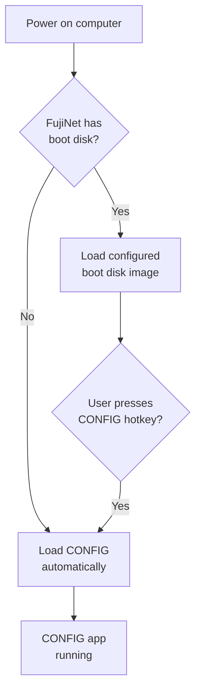
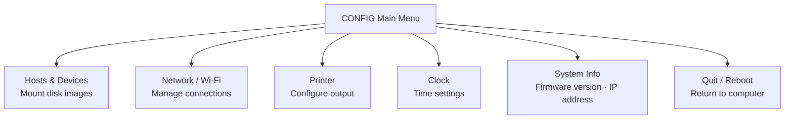
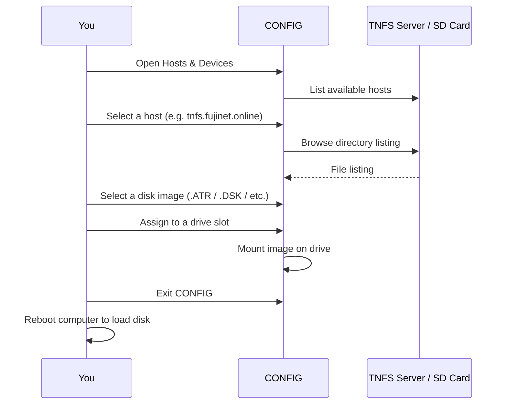

# Using CONFIG

**CONFIG** is FujiNet's built-in control panel application. It runs directly on your vintage computer and gives you full control over:

- Wi-Fi settings
- Disk image mounting (from SD card or TNFS servers)
- Host/server management
- Device settings
- Printer configuration
- Clock and time settings
- Firmware information

CONFIG is a **platform-native application** — it looks and feels like a native program for each computer, using that platform's own display and keyboard conventions. The underlying features are the same across all platforms.

## How CONFIG is launched

The exact method for launching CONFIG varies by platform:

| Platform | How to open CONFIG |
|---|---|
| Atari 8-bit | Hold **`Option`** at boot, or press the button on FujiNet |
| Apple II | Boots automatically; or press the physical CONFIG button |
| Coleco ADAM | Boots automatically from the FujiNet drive |
| Commodore 64 | `LOAD"CONFIG",8,1` then `RUN` |
| CoCo | Load from FujiNet drive as a program |

## CONFIG main menu overview

Every platform's CONFIG shares the same functional sections:

## Hosts & Devices — the most-used section

This is where you mount disk images. The workflow is the same on every platform:

## Platform-specific CONFIG guides

Select your platform for step-by-step navigation instructions:

-   :material-atari: **[Atari 8-bit](atari-8bit.md)**

    Full keyboard mapping, screen layout, and all CONFIG screens for Atari.

-   :fontawesome-brands-apple: **[Apple II](apple-ii.md)**

    CONFIG navigation using Apple II keyboard and ProDOS conventions.

-   :material-television-classic: **[Coleco ADAM](coleco-adam.md)**

    CONFIG on the ADAM using the ADAM keyboard and AdamNet conventions.

-   :material-controller: **[Commodore 64](commodore-64.md)**

    CONFIG navigation using C64 keyboard and PETSCII conventions.

-   :material-television-play: **[Color Computer (CoCo)](coco.md)**

    CONFIG navigation on the CoCo's Motorola 6809 platform.

