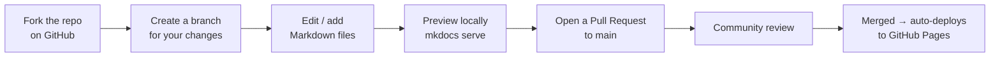
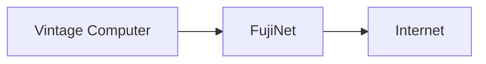

# Contributing to FujiNet Documentation

This documentation site is open source and community-maintained. We welcome contributions of all kinds: fixing typos, improving explanations, adding screenshots, and writing entirely new guides.

## Quick contributions (no local setup needed)

Every page on this site has an **Edit** button (pencil icon, top right). Click it to edit the page directly on GitHub and submit a pull request — no local tools needed.

Use this for:
- Fixing typos or factual errors
- Clarifying confusing wording
- Adding missing information to existing pages

## Full local setup

For larger contributions (new pages, new platform guides, restructuring), set up a local environment:

### Prerequisites

- Python 3.9+
- Git

### Setup steps

```bash
# Clone the repository
git clone https://github.com/FujiNetWIFI/fujinet-mkdocs.git
cd fujinet-mkdocs

# Install dependencies
pip install -r requirements.txt

# Start the live-reload dev server
mkdocs serve
```

Open **`http://127.0.0.1:8000`** in your browser. The site reloads automatically as you edit files.

## Contribution workflow



1. **Fork** `FujiNetWIFI/fujinet-mkdocs` on GitHub
2. **Create a branch**: `git checkout -b add-my-platform`
3. **Make changes** — edit existing pages or add new ones
4. **Preview** with `mkdocs serve`
5. **Open a Pull Request** — the CI will build the docs and confirm they compile cleanly
6. After review and merge, changes deploy automatically to the live site

## Documentation standards

### Writing style

- Write for a **first-time user** who may not know retro computing jargon
- Use **second person** ("you", "your") rather than "the user"
- Keep sentences short and scannable
- Use bullet lists and tables rather than dense paragraphs
- Define acronyms on first use (e.g., "SIO (Serial Input/Output)")

### Markdown conventions

- Use **ATX headings** (`#`, `##`, `###`) — not underline style
- Use **fenced code blocks** with a language hint: ` ```bash ` not bare backticks
- Use **admonitions** for tips, warnings, and notes (see below)
- Prefer **tables** over bulleted key/value lists

### Admonitions (callout boxes)

```markdown
!!! tip "Pro tip"
    Use this for helpful non-essential advice.

!!! note "Note"
    Use this for important context that isn't a warning.

!!! warning "Warning"
    Use this for actions that could cause data loss or breakage.

!!! info "Platform note"
    Use this for platform-specific caveats on shared pages.
```

### Mermaid diagrams

Use Mermaid diagrams to illustrate:
- Hardware connection flows (`flowchart LR`)
- Multi-step sequences (`sequenceDiagram`)
- System architecture (`graph TD`)
- Decision trees (flowcharts)

Keep diagrams simple — if a diagram needs more than 8–10 nodes, split it.

```markdown

```

## Adding a new platform

If FujiNet gains support for a new vintage computer platform, here's how to add full documentation for it. See **[Adding a New Platform](new-platform.md)** for the complete guide.

## File organization

```
docs/
├── index.md                    # Home page
├── what-is-fujinet.md          # Overview / elevator pitch
├── getting-started/
│   ├── index.md                # Platform picker
│   └── <platform>.md           # One file per platform
├── config/
│   ├── index.md                # CONFIG overview
│   └── <platform>.md           # Platform-specific CONFIG guide
├── features/
│   ├── index.md                # Feature overview
│   └── <feature>.md            # One file per feature
├── apps/
│   └── index.md                # App catalog
├── games/
│   ├── index.md                # Games overview
│   ├── multiplayer.md          # Multiplayer games
│   └── high-scores.md          # High score games
└── contributing/
    ├── index.md                # This file
    └── new-platform.md         # Platform addition guide
```

## Getting help

- **Discord**: [discord.gg/7MfFTvD](https://discord.gg/7MfFTvD) — `#documentation` channel
- **GitHub Issues**: Open an issue to discuss a larger change before writing it
- **GitHub Discussions**: For questions about content or structure
