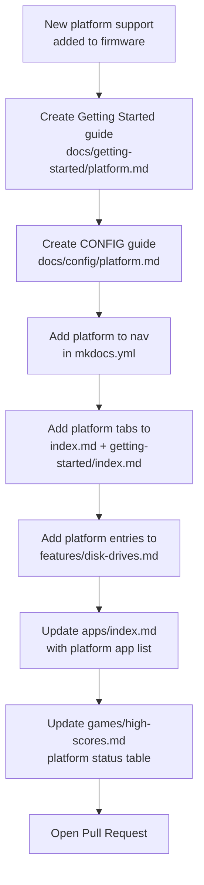
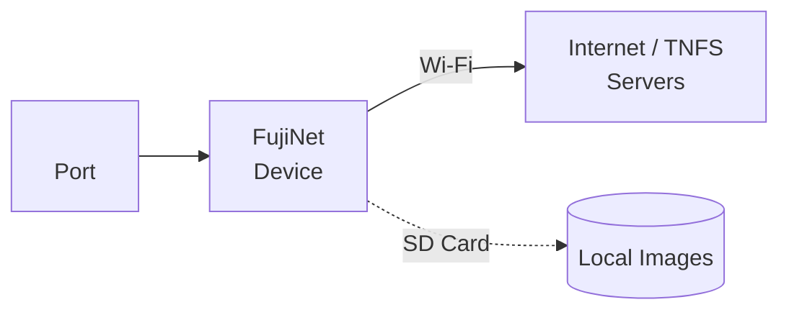

# Adding a New Platform

This guide walks through everything needed to add complete, consistent documentation for a new FujiNet-supported platform. Following this template ensures new platforms integrate smoothly into the existing structure.

## Checklist overview



## Step 1: Create the Getting Started guide

Create `docs/getting-started/<platform-slug>.md` using this template:

```markdown
---
title: Getting Started — <Platform Name>
description: Connect your FujiNet to a <Platform Name>
tags:
  - getting-started
  - <platform-slug>
---

# Getting Started: <Platform Name>

Brief description of the platform and its FujiNet connection method.

!!! note "Platform maturity"  ← include if the port is early-stage
    Describe any limitations or early-stage caveats.

## Compatible computers

| Computer | Notes |
|---|---|
| Model A | Notes |

## What you need

- [x] FujiNet for <Platform> (<bus type> variant)
- [x] <Connection cable> (usually included)
- [x] Your <Platform> computer
- [x] Wi-Fi password for your 2.4 GHz network
- [x] microSD card (FAT32, optional)

## Connection diagram



## Step 1: Connect the hardware
(hardware connection instructions)

## Step 2: Wi-Fi setup
(standard Wi-Fi setup — same pattern as other platforms)

## Step 3: Load CONFIG
(platform-specific CONFIG launch method)

## Step 4: Mount a disk image
(standard mounting steps with platform image formats)

## Troubleshooting

| Symptom | Likely cause | Fix |
|---|---|---|
| ... | ... | ... |

## Next steps

- **Using CONFIG on \<Platform\>** — link to `../config/<platform-slug>.md`
- **[TNFS File Servers](../features/tnfs.md)**
- **[Games](../games/index.md)**
```

## Step 2: Create the CONFIG guide

Create `docs/config/<platform-slug>.md` using this template:

```markdown
---
title: CONFIG — <Platform Name>
description: How to navigate the FujiNet CONFIG application on <Platform Name>
tags:
  - config
  - <platform-slug>
---

# Using CONFIG: <Platform Name>

Brief description of CONFIG on this platform (display type, native conventions).

## Launching CONFIG

| Method | How |
|---|---|
| Automatic | ... |
| Physical button | ... |

## Keyboard reference

| Key | Action |
|---|---|
| Arrow keys | Navigate menus |
| Return / Enter | Select |
| Escape / Break | Go back |

## Main menu

(ASCII art mockup of the menu as displayed on the platform)

## Screen 1: Hosts & Devices

**Supported image formats:**

| Extension | Description |
|---|---|
| `.xxx` | ... |

## Screen 2: Network

(Wi-Fi management — same as other platforms)

## Popular TNFS servers for <Platform>

| Server | Contents |
|---|---|
| `tnfs.fujinet.online` | Official community server |
| `<platform>.irata.online` | <Platform> software archive |
```

## Step 3: Update mkdocs.yml

Add the new platform to the `nav:` section in `mkdocs.yml` in both the **Getting Started** and **Using CONFIG** sections:

```yaml
nav:
  - Getting Started:
    - getting-started/index.md
    # ... existing platforms ...
    - <Platform Name>: getting-started/<platform-slug>.md   # ← add here
  - Using CONFIG:
    - config/index.md
    # ... existing platforms ...
    - <Platform Name>: config/<platform-slug>.md             # ← add here
```

## Step 4: Update shared pages

### docs/index.md

Add a new tab in the "Pick your platform" section:

```markdown
=== ":material-<icon>: <Platform Name>"

    Brief one-sentence description.

    [Get started with <Platform Name> →](getting-started/<platform-slug>.md){ .md-button .md-button--primary }
```

### docs/getting-started/index.md

Add a card in the "Choose your platform" grid:

```markdown
-   :material-<icon>: **<Platform Name>**

    Brief description of the platform and connection method.

    [Get started →](<platform-slug>.md){ .md-button }
```

Add the platform to the "What happens after setup?" CONFIG table.

### docs/config/index.md

Add the platform to the launch methods table and the platform cards grid.

### docs/features/disk-drives.md

Add a new tab in the "Supported image formats by platform" tabbed section with the platform's disk image formats and a row in the "Number of simultaneous drives" table.

### docs/apps/index.md

Add a platform section (even if initially just a stub):

```markdown
## <Platform Name> apps

| App | Description |
|---|---|
| (more apps coming soon) | |

### Where to find <Platform> apps

- `tnfs.fujinet.online` — `/<platform>/`
```

### docs/games/high-scores.md

Add the platform to the "Other platforms" status table at the bottom.

## Choosing a platform icon

Use a Material Design icon that best represents the platform. Browse available icons at [pictogrammers.com/library/mdi](https://pictogrammers.com/library/mdi/). Use the format `:material-icon-name:` in Markdown.

Common choices:
- `:material-atari:` — Atari
- `:fontawesome-brands-apple:` — Apple
- `:material-television-classic:` — generic retro TV/computer
- `:material-controller:` — game controller
- `:material-television-play:` — TV with play button

## Platform slug conventions

The `<platform-slug>` used in filenames should be:
- Lowercase
- Hyphenated (no underscores)
- Descriptive but concise

Examples: `atari-8bit`, `apple-ii`, `commodore-64`, `coleco-adam`, `coco`

## Testing your contribution

Before opening a pull request:

```bash
# Build must succeed with --strict (no warnings)
mkdocs build --strict

# Start local server and verify all pages render correctly
mkdocs serve
```

Check:
- [ ] All new pages appear in the navigation
- [ ] All internal links resolve (no 404s)
- [ ] Mermaid diagrams render correctly
- [ ] Tabbed content works
- [ ] No broken images
- [ ] `mkdocs build --strict` exits with code 0

## Opening the pull request

- Title: `docs: add <Platform Name> platform documentation`
- Description: brief summary of what was added and any areas that still need work
- Link to any relevant firmware issues or firmware platform tracker

The CI pipeline will build the docs automatically and post a comment confirming success. A maintainer will review and merge.
