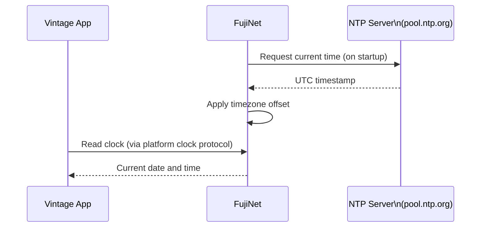

# Network Clock

FujiNet provides the current date and time to your vintage computer by syncing with internet **NTP (Network Time Protocol)** servers. This enables any software designed to use a real-time clock to show the correct time — without a battery-backed clock cartridge.

## How it works

FujiNet fetches the time once at startup and maintains an accurate software clock thereafter.

## Platform clock protocols

| Platform | Clock protocol | Compatible software |
|---|---|---|
| Atari 8-bit | **RTime-8** (`$D5xx`), **APETime** | Anything that reads RTime-8 or APETime |
| Apple II | **ProDOS clock driver** | All ProDOS applications |
| Commodore 64 | TDOS clock / direct read | Clock-aware C64 apps |
| Coleco ADAM | SmartBASIC clock | ADAM productivity software |

## Setting your timezone

In CONFIG → Clock:

1. Use the arrow keys to select your **UTC offset** (e.g., `-5` for US Eastern, `-8` for US Pacific, `+1` for CET).
2. Toggle **DST** (Daylight Saving Time) if applicable.
3. The clock updates immediately.

!!! tip "Why does this matter?"
    Word processors, spreadsheets, and database programs often timestamp files and documents. With FujiNet's clock, those timestamps are accurate — a small but satisfying detail.

## Atari-specific: RTime-8 compatibility

The Atari 8-bit's [RTime-8](https://en.wikipedia.org/wiki/R-Time_8) clock cartridge emulation is transparent — any software that checks `$D5xx` for the clock will work automatically with no modification.

Check CONFIG → System Info to see the current time FujiNet is reporting.
