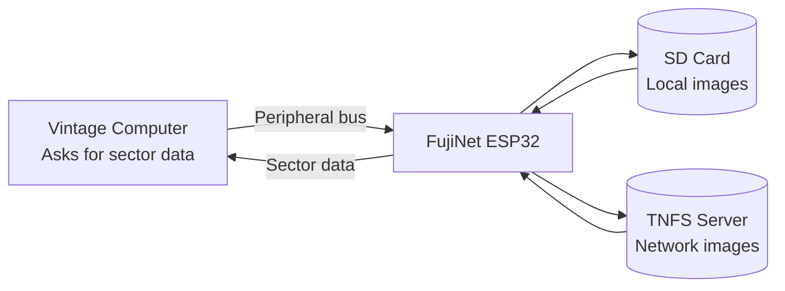

# Virtual Disk Drives

FujiNet's most fundamental feature is **virtual disk drive emulation**. It replaces physical floppy drives by presenting disk image files as real drives to your vintage computer.

## How it works

Your computer sends disk read/write requests over its peripheral bus (SIO, IEC, etc.) exactly as it would to a physical drive. FujiNet intercepts these requests and serves data from either a local SD card image or a network-hosted image — the computer can't tell the difference.

## Supported image formats by platform

=== "Atari 8-bit"

    | Format | Description | Notes |
    |---|---|---|
    | `.ATR` | Atari disk image | Most common format |
    | `.XFD` | Transformed image | Older format, fully supported |
    | `.ATX` | Protected disk image | Copy-protected game support |
    | `.CAS` | Cassette tape image | For tape-based programs |
    | `.COM` / `.XEX` | Executable | Load directly without a disk |

=== "Apple II"

    | Format | Description |
    |---|---|
    | `.PO` | ProDOS order |
    | `.DO` | DOS 3.3 order |
    | `.DSK` | Generic (order auto-detected) |
    | `.2MG` / `.2IMG` | 2IMG with metadata |
    | `.HDV` | Hard disk volume |

=== "Coleco ADAM"

    | Format | Description |
    |---|---|
    | `.ddp` | Digital data pack (tape) |
    | `.dsk` | Disk image |

=== "Commodore 64"

    | Format | Description |
    |---|---|
    | `.D64` | 1541 single-sided |
    | `.D71` | 1571 double-sided |
    | `.D81` | 1581 high-density |
    | `.T64` | Tape image |

=== "CoCo"

    | Format | Description |
    |---|---|
    | `.DSK` | CoCo disk image |
    | `.VHD` | Virtual hard disk |

## Number of simultaneous drives

| Platform | Maximum virtual drives |
|---|---|
| Atari 8-bit | 8 (D1: through D8:) |
| Apple II (SmartPort) | 4 |
| Apple II (Disk II) | 1–2 |
| Coleco ADAM | 4 (2 tape + 2 disk) |
| Commodore | 3 (devices 8, 9, 10) |
| CoCo | 4 |

## Read-only vs. read-write

- **Network-hosted images** (from TNFS servers) are always **read-only**. This protects the shared server files from being corrupted.
- **SD card images** can be mounted **read-write** — changes you make are saved back to the image file.

!!! tip "Make a working copy"
    When experimenting with a game or program, copy the image to your SD card first so you can write to it (for save games, configuration, etc.) without affecting the master copy on the TNFS server.

## Write-protect control

In CONFIG's Hosts & Devices screen, you can toggle the write-protect status of each mounted image using the `W` key (Atari) or equivalent. A lock icon indicates write-protected status.
