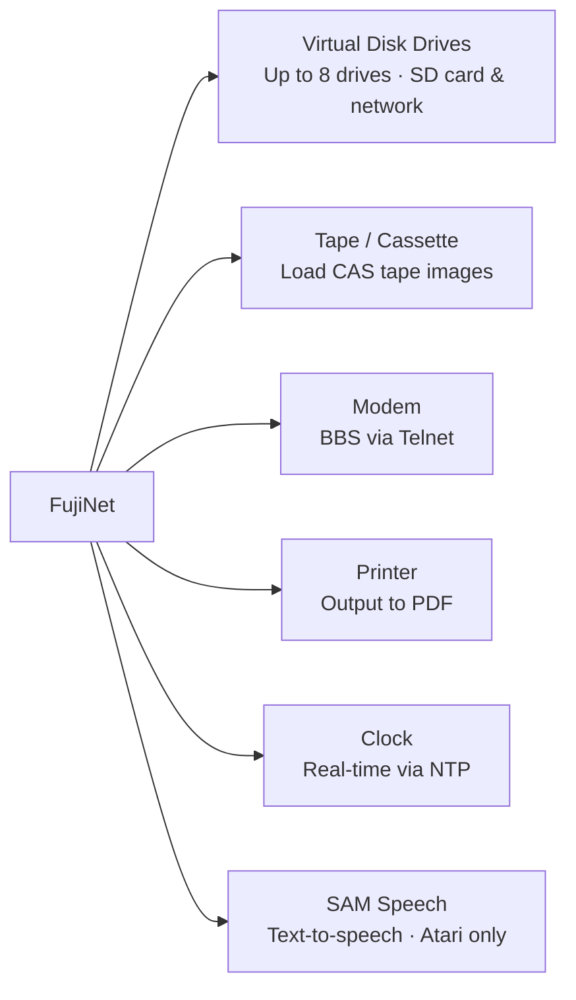

# FujiNet Features

FujiNet provides two categories of functionality: **peripheral emulation** (replacing vintage hardware you might not have) and **network features** (connecting your vintage computer to the internet).

## Peripheral emulation

| Feature | What it does | Guide |
|---|---|---|
| Virtual Disk Drives | Mount disk images from SD card or network as real drives | [Disk Drives](disk-drives.md) |
| Network Device (N:) | TCP/IP networking for vintage apps | [Network Device](network-device.md) |
| Modem & BBS | Dial in to BBSes using Telnet | [Modem & BBS](modem.md) |
| Printer Emulation | Capture printer output as PDF | [Printer](printer.md) |
| Network Clock | Provide real-time date/time via NTP | [Clock](clock.md) |
| TNFS File Servers | Browse community software libraries | [TNFS](tnfs.md) |

## Network features

The **Network Device** (`N:`) is what makes FujiNet unique among peripheral emulators. It gives your vintage computer access to:

- HTTP and HTTPS websites
- FTP servers
- SSH sessions
- Telnet / BBS connections
- TNFS file servers
- TCP and UDP sockets
- JSON parsing

See **[Network Device (N:)](network-device.md)** for the full breakdown.
