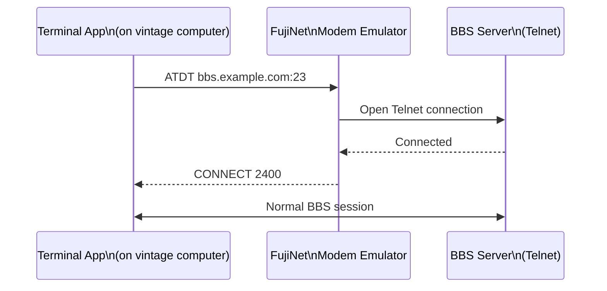

# Modem & BBS

FujiNet emulates a classic **Hayes-compatible modem**, allowing any terminal software that supports a serial modem to connect to modern Telnet-based BBSes and other services — no phone line required.

## How it works



FujiNet translates AT modem commands into real Telnet connections over your Wi-Fi network. Your terminal software thinks it's talking to a real modem.

## Compatible terminal software by platform

=== "Atari 8-bit"

    - **Ice-T XE** — Full-featured terminal with ANSI color support
    - **BOBTERM** — Popular Atari terminal program
    - **Flash** — Fast terminal with many BBS features
    - **DeathBaud** — Modern Atari terminal supporting FujiNet modem

=== "Apple II"

    - **Z-Link** — Full-featured Apple II terminal
    - **Spectrum** — Popular Apple II terminal
    - **Modem MGR** — Simple terminal program

=== "Commodore 64"

    - **CCGMS** — Community-maintained ANSI terminal
    - **Novaterm** — Feature-rich C64 terminal
    - **dialogue64** — Modern C64 terminal

=== "CoCo"

    - **Ultimaterm** — CoCo terminal with ANSI support

## Connecting to a BBS

1. Launch your terminal software and configure it for the modem port.
2. Set baud rate — FujiNet accepts any baud rate (it auto-negotiates).
3. Dial using the AT command:
   ```
   ATDT bbs.fozztexx.com:23
   ```
4. FujiNet translates this to a Telnet connection and returns `CONNECT`.

## Popular retro BBSes

| BBS | Address | Specialty |
|---|---|---|
| Particles! | `particlesbbs.dyndns.org:6400` | General / Atari |
| Bits and Bytes | `bitsandbytes.abj.no:23` | Norwegian retro |
| Digital Distortion | `digdist.bbsindex.com:23` | General |
| Borderline BBS | `borderlinebbs.dyndns.org:6400` | C64 |

!!! tip "ANSI art"
    Many BBSes use ANSI escape codes for color art. Use a terminal program with ANSI support (like Ice-T XE on Atari) for the full experience.

## Phonebook / speed dial

FujiNet's modem emulator maintains a phone book of saved BBS addresses. Access it via CONFIG → Modem to add, edit, and organize your favorite BBSes. Then dial by number:

```
ATDS1   ; dial phonebook entry 1
```
