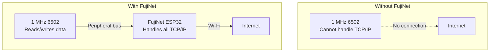
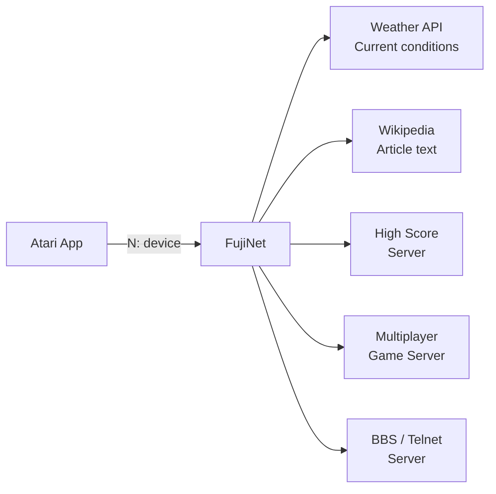
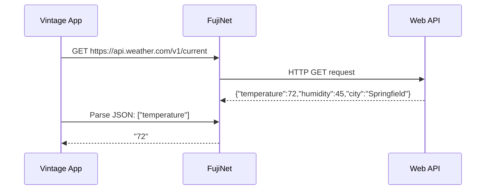

# Network Device (N:)

The **Network Device** — called `N:` on Atari, with equivalents on other platforms — is FujiNet's most powerful and unique feature. It gives your vintage CPU access to the modern internet without the computer itself needing to handle TCP/IP.

## The problem it solves



Your vintage computer treats the network device just like a serial port or file — it simply reads and writes bytes. FujiNet's ESP32 chip handles all the complex TCP/IP processing behind the scenes.

## Supported protocols

| Protocol | Use case |
|---|---|
| **HTTP** | Web pages, APIs, weather data |
| **HTTPS** | Secure web pages and APIs |
| **FTP** | File downloads from FTP servers |
| **SSH** | Secure shell sessions |
| **Telnet** | BBS connections, legacy systems |
| **TNFS** | FujiNet's retro-optimized file server protocol |
| **WebDAV** | Remote file access |
| **TCP** | Raw socket connections |
| **UDP** | Datagrams (used by some games) |
| **JSON** | Parsed HTTP+JSON responses |

## How applications use N:

### Atari example

On Atari, the `N:` device is accessed through CIO (Central I/O) just like any other device:

```asm
; Open N: device for HTTP GET
lda #$03        ; OPEN
sta ICCOM,x
lda #<ndevurl
sta ICBAL,x
lda #>ndevurl
sta ICBAH,x
lda #$04        ; read mode
sta ICAX1,x
jsr CIOV

ndevurl .byte "N:HTTP://api.example.com/data",0
```

BASIC programs can also use `OPEN #1,4,0,"N:HTTP://..."` to read from URLs.

### What this enables

Because apps just read/write strings, developers can create programs that were impossible on vintage hardware:



## Apps built on the network device

| App | Platform | What it does |
|---|---|---|
| FujiNet Weather | Atari | Real-time weather via IP geolocation |
| Wikipedia Reader | Atari | Search and browse Wikipedia |
| Five Card Stud | Multi-platform | Online poker over TCP |
| Fujitzee | Multi-platform | Online Yahtzee over TCP |
| High Score clients | Atari | Submit/retrieve game scores |
| BBS Terminal | All | Telnet into classic BBSes |

## JSON parsing

FujiNet includes an onboard JSON parser that simplifies API access. Instead of your vintage CPU parsing complex JSON text, FujiNet parses it and returns only the fields your program needs:



The JSON query syntax uses a simple path notation (e.g., `["city"]["temperature"]`), letting even BASIC programs extract specific values from complex web API responses.
