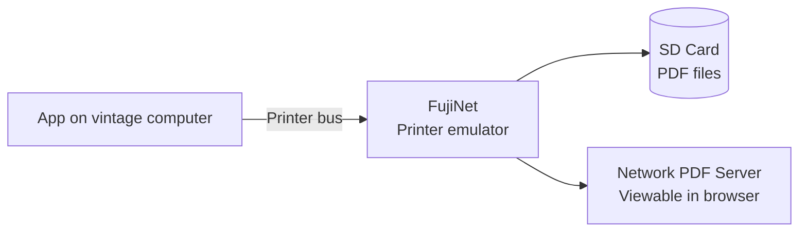

# Printer Emulation

FujiNet emulates classic printers for each platform, capturing output and saving it as **PDF files** on your SD card or forwarding it to a networked PDF service. No need for a physical printer.

## Supported printer emulations by platform

=== "Atari 8-bit"

    | Emulated printer | Original use |
    |---|---|
    | Atari 820 | 40-column thermal printer |
    | Atari 822 | 40-column thermal |
    | Atari 825 | 80-column dot matrix |
    | Atari 1020 | Color plotter |
    | Atari 1025 | 80-column dot matrix |
    | Epson MX-80 | Generic dot matrix |
    | Generic text | Plain text output |

=== "Apple II"

    | Emulated printer | Notes |
    |---|---|
    | Apple ImageWriter | Color ribbon support |
    | Epson MX-80 | Generic dot matrix |
    | Generic text | Plain text |

=== "Commodore 64"

    | Emulated printer | Notes |
    |---|---|
    | Commodore MPS-803 | Standard C64 printer |
    | Commodore 1525 | Graphic dot matrix |
    | Epson MX-80 | Generic |

=== "Coleco ADAM"

    | Emulated printer | Notes |
    |---|---|
    | ADAM Letter-Quality | Daisy wheel emulation |
    | Generic text | Plain text |

## Where output goes

**SD card** — PDFs are saved as sequentially numbered files (e.g., `PRINT001.PDF`, `PRINT002.PDF`) in the root of the SD card.

**Network** — FujiNet can send printer output to a lightweight PDF server running on your PC or a Raspberry Pi, making printed documents immediately viewable on any device on your network.

## Configuring the printer

In CONFIG → Printer:

1. Select the **printer type** to emulate.
2. Choose the **output destination** (SD card or network PDF server).
3. Set **paper width** (40 or 80 columns depending on emulated model).

Any software that prints to the platform's printer device will automatically use FujiNet's emulated printer.

!!! tip "Plotter output"
    The Atari 1020 emulation renders plotter graphics to PDF vector art — great for capturing graphics from drawing programs.
