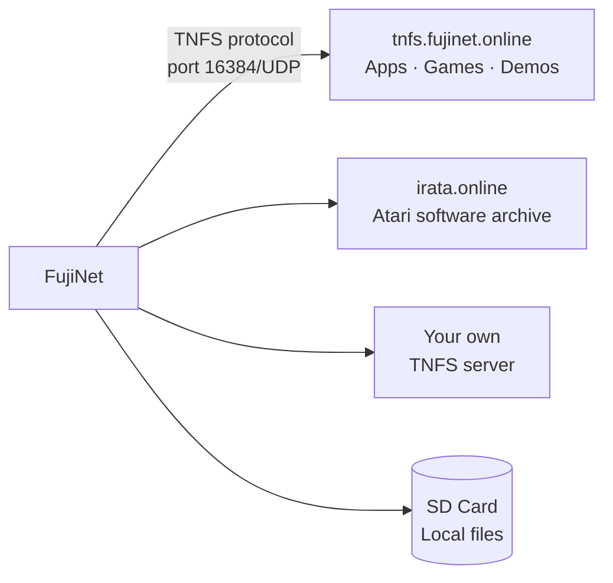

# TNFS File Servers

**TNFS** (Trivial Network File System) is a lightweight file system protocol purpose-built for FujiNet and other retro networking projects. It lets your vintage computer browse and mount disk images hosted on remote servers over the internet.

## What TNFS enables



When you browse a TNFS server in CONFIG, it feels just like browsing a local file system — navigate directories, select a disk image, and mount it. The image streams from the internet in real time as your computer reads sectors.

## Community TNFS servers

### tnfs.fujinet.online — Official server

The primary community server maintained by the FujiNet project.

| Directory | Contents |
|---|---|
| `/atari8/apps/` | FujiNet-aware Atari applications |
| `/atari8/games/` | Classic Atari games |
| `/atari8/demos/` | Demoscene releases |
| `/apple2/` | Apple II software |
| `/c64/` | Commodore 64 software |
| `/adam/` | Coleco ADAM software |
| `/coco/` | CoCo software |

### irata.online — Atari archive

A large community-curated archive focused on Atari 8-bit software, including high-score enabled patches.

| Path | Contents |
|---|---|
| `irata.online` (root) | Software organized by category |
| `scores.irata.online` | High score leaderboard web view |

## Adding a TNFS server in CONFIG

1. Open CONFIG → **Hosts & Devices**.
2. Move to an empty host slot.
3. Press **Return** (or equivalent) to edit the entry.
4. Type the server hostname (e.g., `tnfs.fujinet.online`) and confirm.
5. The server is saved and immediately browsable.

!!! note "Port"
    TNFS uses **UDP port 16384** by default. If your router has aggressive firewall rules, you may need to allow outbound UDP on this port. Most home networks work without any changes.

## Running your own TNFS server

You can host your own TNFS server to share disk images with others or use as a personal library:

```bash
# Install the Python TNFS server
pip install tnfsd

# Serve a directory of disk images
tnfsd --root /path/to/disk/images --port 16384
```

Or use the official Go implementation:

```bash
git clone https://github.com/FujiNetWIFI/tnfsd
cd tnfsd
go build
./tnfsd -root /path/to/images
```

!!! tip "Share with the community"
    If you run a public TNFS server with unique or curated content, let the FujiNet community know on Discord — others may want to add it!

## TNFS vs. HTTP image loading

FujiNet can also load disk images via HTTP URL. TNFS is preferred for browsing because it supports directory listings and is optimized for low-latency sector reads. HTTP is useful for mounting a specific known image directly by URL.
