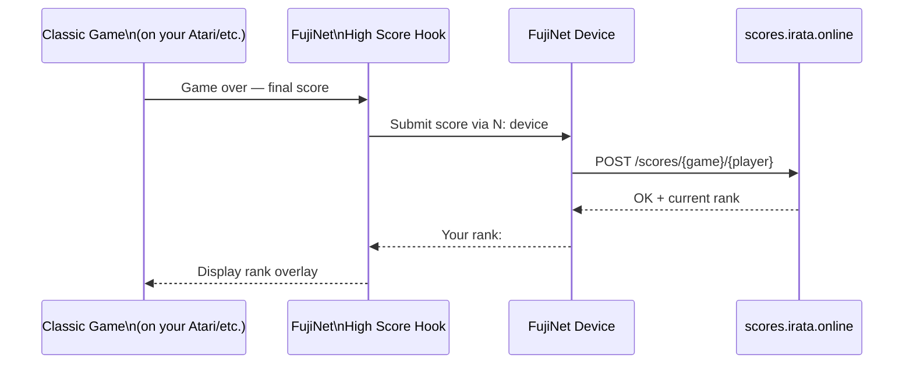

# High Score Games

FujiNet enables classic games to submit scores to a **global online leaderboard**, letting you compete with vintage computer users worldwide. Existing games are patched to hook into the score submission system — no rewrite required.

## How high scores work

The high score hook is a small patch added to existing game binaries. When the game ends, the patch intercepts the score, sends it via the N: device, and receives back the player's worldwide rank.

## Viewing scores online

High scores are publicly viewable at **[scores.irata.online](https://scores.irata.online)** — no FujiNet needed to browse the leaderboards.

Scores **reset monthly**, so there's always a fresh competition each month.

## High score enabled games (Atari 8-bit)

### Original arcade ports with high score tables

These classic games have always had high score tables — FujiNet patches them to submit those scores online:

| Game | Genre | Notes |
|---|---|---|
| **Jumpman** | Platformer | Original Atari high score table preserved |
| **Gorf** | Shoot 'em up | Multiple wave scoring |
| **Spelunker** | Platformer | Cave exploration |

### Arcade ports patched with high score support

These games were patched to add online high score submission:

| Game | Genre | Original by |
|---|---|---|
| **PAC-MAN** | Maze | Atari / Namco |
| **Defender** | Shoot 'em up | Williams |
| **Dig-Dug** | Maze | Namco |
| **Donkey Kong** | Platformer | Nintendo |
| **Pengo** | Puzzle | Sega |
| **Baja Buggies** | Racing | Atari |
| **Kid Grid** | Maze | Atari |

### Games with scores in development

High score patches are being developed for these games:

| Game | Genre | Status |
|---|---|---|
| **Berzerk** | Shoot 'em up | In progress |
| **Moon Patrol Redux** | Side-scroller | In progress |
| **Gyruss** | Shoot 'em up | In progress |
| **Star Trek** | Strategy | In progress |
| **Embargo** | Strategy | In progress |

## How to play high score games

1. In CONFIG → Hosts & Devices, connect to `irata.online`
2. Navigate to the high score games directory
3. Mount the patched `.ATR` on D1: and reboot
4. Play the game as normal — when the game ends, FujiNet automatically submits your score
5. Visit **[scores.irata.online](https://scores.irata.online)** to see where you rank

!!! tip "Set your player name"
    Before playing, set your handle in CONFIG → System Info → Player Name. This is the name that appears on the leaderboard.

## Submitting a high score patch

Have programming skills and want to add high score support to a classic game? The process is:

1. Identify where the game stores the final score in memory
2. Add a hook that reads the score at game-over and calls the high score submission routine
3. Test with a real FujiNet
4. Submit the patched binary to the community via a pull request or Discord

See the **[FujiNet Discord](https://discord.gg/7MfFTvD)** `#development` channel for technical details on the score submission protocol.

## Other platforms

High score support is primarily developed for **Atari 8-bit** currently, as it was the first FujiNet platform. Work is ongoing to bring high score enabled games to Apple II, Commodore 64, and other platforms.

| Platform | High score status |
|---|---|
| Atari 8-bit | Available for 10+ games |
| Apple II | In development |
| Commodore 64 | In development |
| Coleco ADAM | Planned |
| CoCo | Planned |
