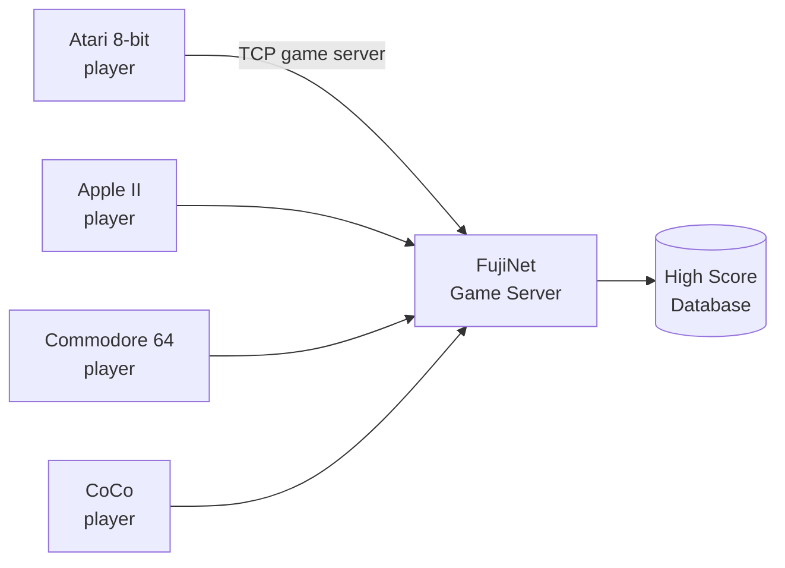

# FujiNet Games

FujiNet brings two exciting gaming features to vintage computers:

1. **Cross-platform multiplayer** — Play against people on *different* vintage computers in real time
2. **Global high scores** — Submit your scores to a worldwide leaderboard, viewable online

## Game categories

-   :material-cards-playing: **[Multiplayer Games](multiplayer.md)**

    Turn-based and real-time games where you play against other FujiNet users — on any platform.

-   :material-trophy: **[High Score Games](high-scores.md)**

    Classic games patched to submit scores to a global leaderboard at scores.irata.online.

## How to find and load games

All FujiNet games are available via TNFS from the official servers:

=== "Atari 8-bit"

    1. In CONFIG → Hosts & Devices, select `tnfs.fujinet.online` or `irata.online`
    2. Navigate to `/atari8/games/`
    3. Mount the game `.ATR` on D1: and reboot

=== "Apple II"

    1. In CONFIG → Hosts & Devices, select `tnfs.fujinet.online`
    2. Navigate to `/apple2/games/`
    3. Mount the game image on S6D1 and reboot

=== "Commodore 64"

    1. In CONFIG → Hosts & Devices, select `tnfs.fujinet.online`
    2. Navigate to `/c64/games/`
    3. Mount the game image on device 8

=== "CoCo / ADAM"

    1. In CONFIG → Hosts & Devices, select `tnfs.fujinet.online`
    2. Navigate to the appropriate platform directory
    3. Mount and load as normal for your platform
