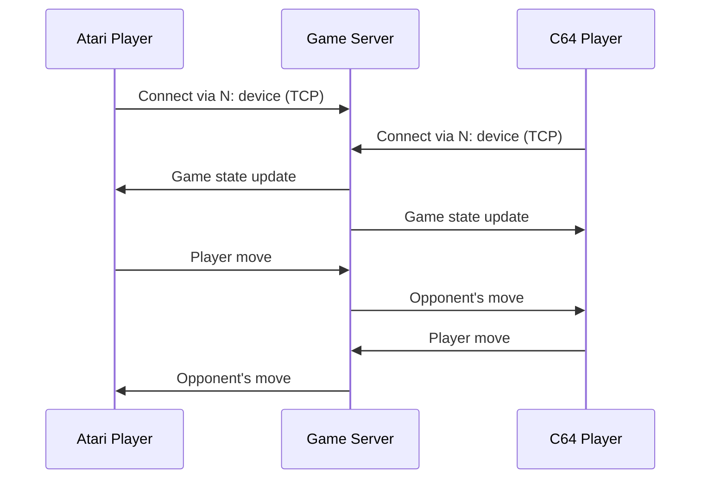
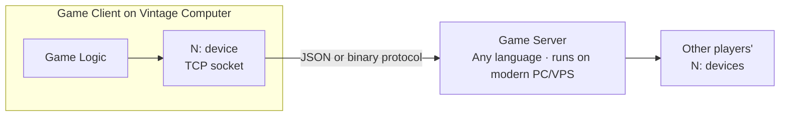

# Multiplayer Games

One of FujiNet's most remarkable achievements is **cross-platform online multiplayer** — a player on an Atari can play against a player on an Apple II or Commodore 64, in real time, over the internet. This was science fiction for vintage computer owners until FujiNet.

## How cross-platform multiplayer works

The game server mediates between all players. Each platform sends moves in a common wire format; the server relays them to all other players. The native game client on each platform handles the platform-specific display and controls.

## Available multiplayer games

### Five Card Stud Poker

The original FujiNet multiplayer game. Play Texas Hold'em-style five-card stud poker against up to five other players, on any FujiNet-supported platform.

| Detail | Info |
|---|---|
| Players | 2–6 |
| Platforms | Atari 8-bit · Apple II · Commodore 64 · CoCo · Coleco ADAM |
| Type | Turn-based card game |
| Server | `game.fujinet.online` (auto-configured) |

**How to play:**
1. Load the Five Card Stud disk image from `tnfs.fujinet.online/games/poker/`
2. Launch the game — it connects automatically to the game server
3. Wait in the lobby for other players, or start a private table with friends
4. Play poker! The game handles all dealing, betting, and hand evaluation.

### Fujitzee

A Yahtzee-style dice game, playable cross-platform against other FujiNet users.

| Detail | Info |
|---|---|
| Players | 2–4 |
| Platforms | Atari 8-bit · Apple II · Commodore 64 · CoCo · Coleco ADAM |
| Type | Turn-based dice game |
| Server | `game.fujinet.online` (auto-configured) |

**How to play:**
1. Load the Fujitzee disk image from `tnfs.fujinet.online/games/fujitzee/`
2. Launch the game and join or create a room
3. Roll dice, choose scoring categories, and try to beat your opponents over 13 rounds

## Playing with friends

Both games support **private rooms** — you create a room with a password and share it with friends so you can play together without joining a random public game.

!!! tip "Finding players"
    Join the **#gaming** channel in the [FujiNet Discord](https://discord.gg/7MfFTvD) to find other players to game with and organize sessions.

## Developing a new multiplayer game

Interested in writing a new cross-platform multiplayer game? The pattern is well-established:

1. Write a lightweight server in Python, Go, or any language
2. On the vintage side, open a TCP connection to the server via `N:TCP://server:port`
3. Exchange game state as simple text or binary messages
4. Implement the game client natively for each platform

The FujiNet community welcomes new game contributions — see [Contributing](../contributing/index.md) for how to get involved.
