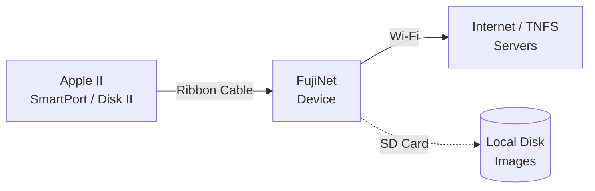

# Getting Started: Apple II

FujiNet for Apple II connects via the **SmartPort** or **Disk II** interface, allowing it to appear as one or more disk drives alongside your existing hardware.

## Compatible computers

| Computer | Interface | Slot |
|---|---|---|
| Apple II | Disk II controller card | Slot 6 (typical) |
| Apple II+ | Disk II controller card | Slot 6 (typical) |
| Apple IIe | Disk II controller card or SmartPort | Slot 5 or 6 |
| Apple IIc | Internal SmartPort | External port on back |
| Apple IIc+ | Internal SmartPort | External port on back |
| Apple IIgs | SmartPort | Slot 5 |
| Apple III | Varies | See notes |

## What you need

- [x] FujiNet for Apple II (SmartPort or Disk II variant — check which you need for your model)
- [x] Your Apple II family computer
- [x] Wi-Fi password for your 2.4 GHz network
- [x] microSD card (FAT32, optional)

## Connection diagram

!!! note "SmartPort vs. Disk II"
    **SmartPort** (IIc, IIgs, and IIe with Saturn or third-party card) allows FujiNet to present up to 4 virtual drives. **Disk II** (II, II+, older IIe) presents a single drive. Check your hardware to choose the right FujiNet variant.

## Step 1: Connect the hardware

1. **Power off** your Apple II.
2. For **slot-based machines** (II, II+, IIe):
   - Insert the FujiNet card (or a Disk II card with FujiNet attached) into **Slot 5 or 6**.
3. For **IIc / IIc+**:
   - Plug FujiNet into the external **SmartPort connector** on the back of the machine.
4. For **IIgs**:
   - Connect to the SmartPort connector or install in **Slot 5**.
5. Insert your microSD card if you have one.

!!! warning "Power off before connecting"
    Always power off before inserting or removing cards and peripherals on Apple II hardware.

## Step 2: First power-on and Wi-Fi setup

1. Power on your Apple II.
2. Watch the FujiNet activity LED:
   - **Flashing** — booting / connecting to Wi-Fi
   - **Solid on** — connected and ready
   - **Slow pulse** — no Wi-Fi configured
3. If this is a **first-time setup**, FujiNet broadcasts a **`FujiNet-XXXXXX`** access point.

### Configuring Wi-Fi via the setup hotspot

1. Connect a phone, tablet, or laptop to **`FujiNet-XXXXXX`**.
2. Open **`http://192.168.4.1`** in a browser.
3. Enter your home Wi-Fi SSID and password, then click **Save**.
4. FujiNet reboots and connects to your network.

## Step 3: Boot CONFIG

On Apple II, CONFIG is accessed as a bootable disk image that FujiNet presents automatically:

1. Boot your Apple II normally — FujiNet presents the **CONFIG disk** as the first drive.
2. The CONFIG program loads and displays the main menu.

!!! tip "Full CONFIG guide"
    See **[Using CONFIG — Apple II](../config/apple-ii.md)** for a complete walkthrough.

## Step 4: Mount a disk image

1. In CONFIG, go to **Hosts & Devices**.
2. Select an online TNFS server or your SD card.
3. Browse to a `.PO`, `.DO`, `.DSK`, or `.2MG` disk image and select it.
4. Assign it to a drive slot (S6D1, S6D2, etc.).
5. Exit CONFIG and reboot — the image will load.

## Troubleshooting

| Symptom | Likely cause | Fix |
|---|---|---|
| Apple II shows `]` BASIC prompt, no CONFIG | Card not recognized in slot | Try a different slot; ensure card is fully seated |
| CONFIG loads but can't connect | Wi-Fi not configured | Reconfigure via the `FujiNet-XXXXXX` hotspot |
| Drive not found (`I/O ERROR`) | Wrong interface type | Ensure you have the SmartPort vs. Disk II correct variant |

## Next steps

- **[Using CONFIG on Apple II](../config/apple-ii.md)** — full CONFIG navigation guide
- **[TNFS File Servers](../features/tnfs.md)** — browse community software libraries
- **[Apps](../apps/index.md)** — FujiNet-enabled software
