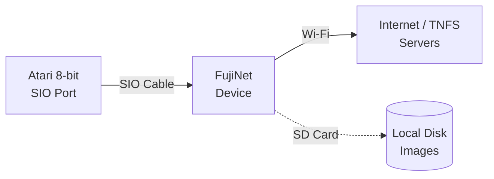
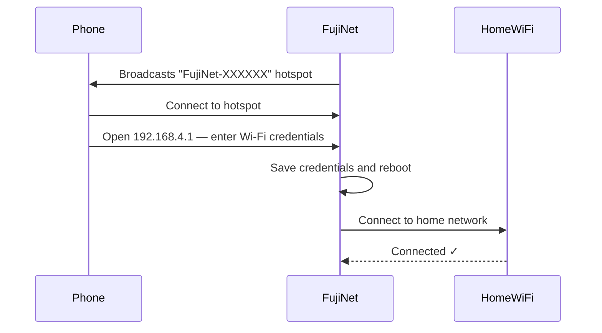

# Getting Started: Atari 8-bit

FujiNet was originally designed for the Atari 8-bit line and has the most mature software ecosystem of any supported platform. This guide covers connecting the device and getting your first disk loaded.

## Compatible computers

| Computer | Notes |
|---|---|
| Atari 400 | SIO port on left side |
| Atari 800 | SIO port on left side |
| Atari 600XL | SIO port on right side |
| Atari 800XL | SIO port on right side |
| Atari 65XE / 130XE | SIO port on right side |
| Atari XEGS | SIO port on right side |

## What you need

- [x] FujiNet for Atari (SIO connector variant)
- [x] SIO cable (usually included with the device)
- [x] Your Atari computer
- [x] Wi-Fi password for your 2.4 GHz network
- [x] microSD card (FAT32, optional for local images)

## Connection diagram

!!! info "SIO is daisy-chainable"
    The SIO bus supports up to **8 devices** chained together. FujiNet has two SIO connectors: plug the cable from your Atari into one end and chain additional SIO devices (like a real 1050 drive) from the other. FujiNet always acts as **device 1 (D1:)** by default.

## Step 1: Connect the hardware

1. **Power off** your Atari.
2. Plug the SIO cable into the **SIO port** on your Atari.
3. Plug the other end into **either** SIO port on the FujiNet.
4. If you have a microSD card with disk images, insert it now.
5. Do **not** power on yet.

!!! warning "Always connect SIO with power off"
    Plugging or unplugging SIO devices while the Atari is powered on can damage both the computer and the device.

## Step 2: First power-on and Wi-Fi setup

1. **Power on** the FujiNet first (if it has a separate power source), then power on your Atari.
   - Many Atari models power the SIO bus — FujiNet may power directly from SIO.
2. Watch the FujiNet LEDs:
   - **Solid blue** — booting
   - **Flashing blue** — connecting to Wi-Fi
   - **Flashing orange** — no Wi-Fi configured (first run)
3. If this is a **first-time setup** (no Wi-Fi saved), FujiNet creates a temporary Wi-Fi access point called **`FujiNet-XXXXXX`**.

### Configuring Wi-Fi via the setup hotspot

1. On a phone, tablet, or laptop: connect to the **`FujiNet-XXXXXX`** Wi-Fi network.
2. Open a browser and navigate to **`http://192.168.4.1`**
3. Click **"WiFi Settings"** and enter your home Wi-Fi network name (SSID) and password.
4. Click **Save** — FujiNet will reboot and connect.

## Step 3: Load the CONFIG app

CONFIG is the FujiNet control panel. On Atari, you access it by:

1. Hold **`Option`** while booting (or just let the Atari boot normally — FujiNet will present CONFIG as the default disk).
2. The CONFIG screen appears: a menu-driven interface for managing disk images, Wi-Fi, and settings.

If CONFIG doesn't appear automatically, you can force-load it:
- Hold the **button on the FujiNet device** for 2 seconds while the Atari is running. This forces FujiNet to present CONFIG on the next cold boot.

!!! tip "Full CONFIG guide"
    See **[Using CONFIG — Atari 8-bit](../config/atari-8bit.md)** for a complete walkthrough of every CONFIG screen.

## Step 4: Mount your first disk image

### From an online TNFS server

1. In CONFIG, navigate to **Hosts & Devices**.
2. The default TNFS host **`tnfs.fujinet.online`** (or `irata.online`) is pre-configured.
3. Browse to a directory, select a `.ATR` file, and press **Return** to mount it on D1:.
4. Press **Escape** to exit CONFIG.
5. **Cold boot** your Atari (hold Reset) — the mounted image will load.

### From SD card

1. Insert your FAT32-formatted microSD card with `.ATR` files.
2. In CONFIG, go to **Hosts & Devices**, select the **SD card** host.
3. Browse and mount as above.

## Troubleshooting

| Symptom | Likely cause | Fix |
|---|---|---|
| Atari shows BASIC or RAM test, no CONFIG | FujiNet not powering on | Check SIO cable; try external USB power |
| CONFIG loads but shows "No hosts" | Wi-Fi not connected | Check Wi-Fi settings in CONFIG → Network |
| Disk mounts but Atari won't boot it | Image format mismatch | Ensure the image is single-density `.ATR` or matches your drive type |
| FujiNet LED stays solid orange | No SD card and no Wi-Fi | Insert SD card or configure Wi-Fi first |

## Next steps

- **[Using CONFIG on Atari](../config/atari-8bit.md)** — full CONFIG navigation guide
- **[TNFS File Servers](../features/tnfs.md)** — connect to community software libraries
- **[Apps for Atari](../apps/index.md)** — software to run on your Atari via FujiNet
- **[Games](../games/index.md)** — multiplayer and high-score enabled games
