# FujiNet for CoCo: The Basics

*Everything you need to get up and running with FujiNet on the Tandy Color Computer.*

---

## Chapter 1 — Introduction

### What is FujiNet?

FujiNet is a multi-function peripheral device for classic computers — including your Tandy Color Computer. It connects to your CoCo's cartridge port and gives it abilities it never had before: network access, virtual disk drives, a real-time clock, and more.

By the time you finish this guide, you'll be mounting disk images and loading programs from across the internet.

!!! note "FujiNet's origins"
    FujiNet was originally developed for the Atari 8-bit family and has since been expanded to support many classic computers, including the CoCo. The community is active and growing!

### What can FujiNet do for your CoCo?

- Load disk images (`.DSK` files) from a local SD card or a network server
- Connect your CoCo to a Wi-Fi network
- Use virtual disk drives — no physical disks required
- Access online resources directly from your CoCo

---

## Chapter 2 — Hardware Setup and Installation

### What you'll need

Other than your FujiNet and your CoCo, you'll need a **MicroSD card formatted in FAT32**.

!!! tip "MicroSD card recommendations"
    Use a 64 GB or smaller card (8–32 GB is more than adequate). Stick with a known reliable brand such as **SanDisk** or **Transcend**.

To format FAT32 on Windows: insert the card, right-click it in Explorer, choose **Format**, select **FAT32**, and proceed.

### Configure the DIP switches for your CoCo model

Your FujiNet has a pair of DIP switches on top that must be set to match your CoCo model. These select the serial port speed and the correct HDB-DOS ROM:

| Computer | DIP 1 | DIP 2 | Serial speed |
|---|---|---|---|
| CoCo 1 | ON | ON | 38,400 bps |
| CoCo 2 | OFF | ON | 57,600 bps |
| CoCo 3 | ON | OFF | 115,200 bps |
| Dragon 32/64 | OFF | OFF | — |

!!! note "CoCo 3 double-speed mode"
    FujiNet uses HDB-DOS which employs the "double speed poke" to achieve 115,200 bps on CoCo 3. This is a feature of HDB-DOS and DriveWire, not FujiNet itself.

    To disable double-speed mode temporarily, type at the `OK` prompt:
    ```
    POKE65497,0:POKE65496,0
    ```
    Note that HDB-DOS will re-enable it automatically whenever disk I/O through FujiNet is accessed.

### Connecting the hardware

1. **Turn off** your Color Computer.
2. Insert your MicroSD card into the FujiNet slot.
3. Insert your FujiNet into the **cartridge port** on the right side of the CoCo.
4. Plug the cable into the **SERIAL I/O** port on the back of your CoCo.
5. **Power on** your CoCo.

!!! warning "Power off before connecting"
    Always turn off your CoCo before inserting or removing the FujiNet device. Plugging it in with power on can damage your hardware.

### Initial power-on

If FujiNet is connected properly, you'll see a message that the FujiNet config is loading, followed quickly by the network configuration screen:

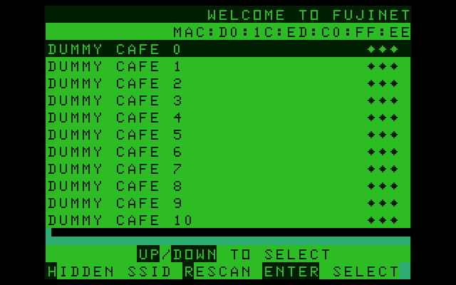

If you don't see this screen, try:

- Check that FujiNet is firmly seated in the cartridge port
- Make sure your SD card is properly inserted
- Ensure the contacts on the card edge of the FujiNet cartridge are clean
- Ask for help on the [FujiNet Discord](https://discord.gg/7MfFTvD) or Facebook group

---

## Chapter 3 — The Configuration Program

The configuration program is FujiNet's built-in control panel. It lets you manage your Wi-Fi network, disk images, device settings, and more.

### Starting the configuration program

The configuration program starts automatically when you power up your CoCo with FujiNet inserted.

To restart it from a BASIC prompt, press **RESET** on the back of the CoCo, then type:

```
DOS
```

### The Network Configuration Screen

The first screen you see on power-up is the **network selection screen**:


The screen lists nearby Wi-Fi networks (name on the left, signal strength in asterisks on the right).

| Key | Action |
|---|---|
| `↑` / `↓` | Move between networks |
| `H` | Enter a hidden network name (one that doesn't broadcast its SSID) |
| `R` | Rescan for networks |
| `Enter` | Select highlighted network |

After pressing **Enter**, you'll be prompted for the network password. Characters are masked with `*` as you type. Lowercase by default; hold **Shift** for uppercase. Press **Enter** to connect.

On successful connection, you'll be taken to the **Host Slots** screen.

### The Host Slots Screen

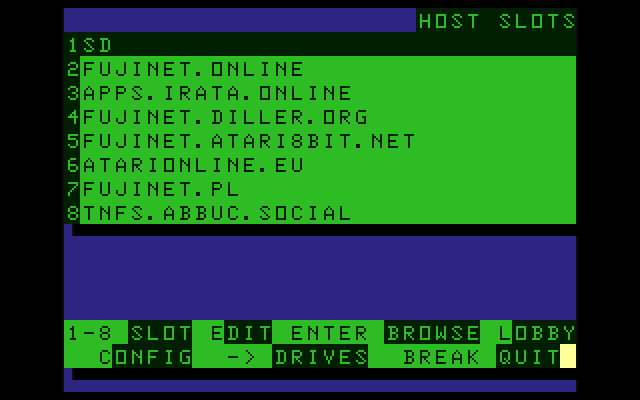

Your FujiNet loads programs by connecting disk image files — on your SD card or a network server — to drive slots. There are **8 host slots**.

**Slot 1 — SD card:**
The first slot is reserved for your SD card and must always be named **`SD`** (in all caps). This is set automatically.

**Slots 2–8 — Network servers:**
Enter TNFS server hostnames or IP addresses. Example: `tnfs.fujinet.online`.

!!! tip "Finding TNFS servers"
    A current list of community TNFS servers is available at [fujinet.online/tnfs-server-status](https://fujinet.online/tnfs-server-status).

| Key | Action |
|---|---|
| `1`–`8` or `↑`/`↓` + `E` | Edit a host slot |
| `Enter` on a host | Browse its files |
| `L` | Boot to the FujiNet Game Lobby (multiplayer games) |
| `C` | Open the Configuration screen |
| `→` | Open the Drives screen |
| `Break` | Exit CONFIG, mount selected images, and reset CoCo |

!!! note "Game Lobby"
    Pressing `L` loads the FujiNet Game Lobby where you can play online multiplayer games (Five Card Stud, Battleship, Fujitzee) against players on other 8-bit computers. If the `L` command isn't yet in your firmware, load it manually: set a host slot to `tnfs.fujinet.online`, navigate to the `COCO` directory, and load `LOBBY.DSK`.

### The Configuration Screen

Press **`C`** from the Hosts screen to open the Configuration screen:

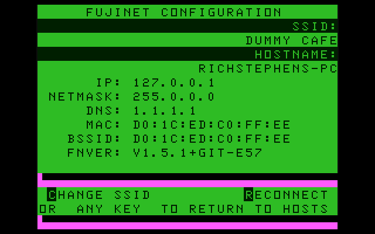

This screen shows:
- Currently connected Wi-Fi **SSID**
- FujiNet **hostname**
- **IP address**, netmask, DNS
- **MAC address** and BSSID
- **Firmware version** (`FNVER`)

| Key | Action |
|---|---|
| `C` | Change SSID (returns to network selection screen) |
| `R` | Reconnect to the current network |
| Any other key | Return to Host Slots screen |

### The Drives Screen

Press **`→`** from the Host Slots screen to open the **Drive Slots screen**:

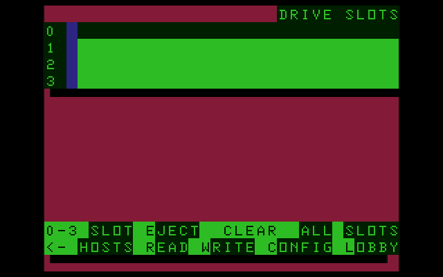

Like standard CoCo DECB, there are **4 drive slots** numbered 0–3. A color indicator next to each slot shows read-only or read-write status.

| Key | Action |
|---|---|
| `0`–`3` or `↑`/`↓` | Select a drive slot |
| `R` | Set selected slot to read-only |
| `W` | Set selected slot to read-write |
| `E` | Eject the image from the selected slot |
| `Clear` | Eject all drive slots |
| `←` | Return to Host Slots screen |
| `Break` | Exit CONFIG and reset CoCo |

!!! warning "Read-write mode"
    Only use **Write** mode when working with a disk image on your own SD card or local server. Never write to a shared network image.

### Navigating host folders and selecting a disk image

Press **Enter** on a populated host slot to browse its files:

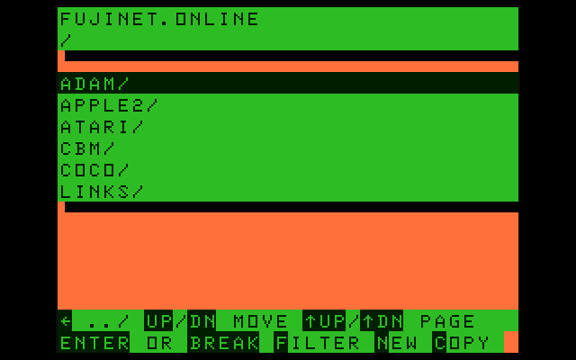

The top of the screen shows the host name and current directory path. Entries ending with `/` are directories.

| Key | Action |
|---|---|
| `↑` / `↓` | Move up/down the list |
| `Enter` | Enter a directory or select a file |
| `←` | Go up to the parent directory |
| `Shift`+`↑` / `Shift`+`↓` | Jump to previous/next page |
| `F` | Enter a filter (e.g. `W*.*` shows files starting with W; `!word` recursively searches subfolders) |
| `N` | Create a new 157k floppy disk image (SD card only) |
| `C` | Copy a disk image to another host/folder |

!!! note "Long filenames"
    Filenames longer than 32 characters are "ellipsized" — the config shows the first and last few characters with `...` in the middle. Hovering on a long filename for 5 seconds scrolls the full name.

**To select a disk image**, navigate to a `.DSK` file and press **Enter**:

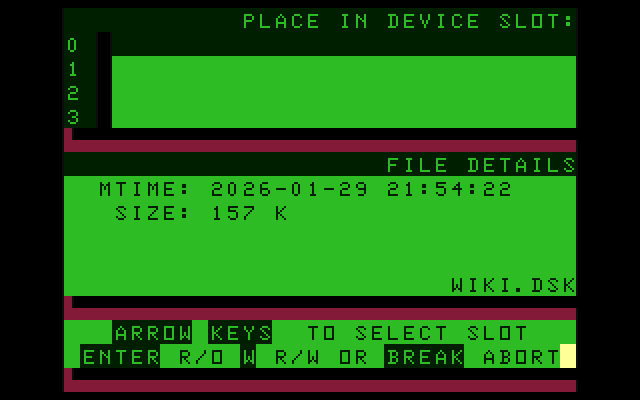

The screen shows the file's modification time, size, and name. Use arrow keys to select the drive slot, then:

| Key | Action |
|---|---|
| `Enter` | Mount read-only |
| `W` | Mount read-write |
| `Break` | Cancel |

After mounting, you'll return to the file browser in the same location.

When you've mounted all the images you need, press **Break** at the Host Slots screen to exit CONFIG. The CoCo resets and returns to an `OK` prompt with your drives mounted.

!!! tip "Autostart"
    If the disk image in drive slot 0 contains a file named `AUTOEXEC.BAS`, HDB-DOS runs it automatically on reset — this is how the CONFIG program itself launches on power-up.

---

## Chapter 4 — Working with Disk Images in HDB-DOS

FujiNet uses **HDB-DOS** — an extended version of standard Tandy Disk Extended Color BASIC (DECB). In addition to standard DECB commands (`DIR`, `LOAD`, `LOADM`, `RUN`), HDB-DOS adds several useful features:

### AUTOEXEC.BAS

On power-up, HDB-DOS automatically looks for and runs `AUTOEXEC.BAS` on the disk image in drive slot 0. The `DOS` command re-initiates this.

!!! note
    This is how the CONFIG program auto-launches when you power up with FujiNet. Pressing **Reset** re-loads the CONFIG disk so you can type `DOS` to restart CONFIG.

### RUNM

Standard DECB requires two steps to run a binary executable:
```
LOADM "PROGRAM.BIN"
EXEC
```

HDB-DOS shortens this to one command:
```
RUNM "PROGRAM.BIN"
```

### DRIVE #

In standard DECB, you switch drives with `DRIVE X`. In HDB-DOS, use the `#` symbol:

```
DRIVE #1
```

This switches to the disk image mounted in drive slot 1.

### FLEXIKEY

HDB-DOS adds command-line editing shortcuts:

| Key | Action |
|---|---|
| `→` (one at a time) | Recall the last command character by character |
| `Shift`+`→` | Recall the entire last command at once |
| `←` (one at a time) | Delete the last character (same as Backspace) |
| `Shift`+`←` | Clear the entire current line |

!!! note "More HDB-DOS features"
    For a full reference, see the [HDB-DOS User Manual](http://cloud9tech.com/Cloud-9/Support/HDB-DOS%20User%20Manual.pdf). Note: some HDB-DOS features relate to real hard drives and don't apply to FujiNet. The FujiNet team did not write HDB-DOS and cannot modify it.

---

## Chapter 5 — FujiNet CoCo Programs

The FujiNet game lobby gives access to multiplayer games. Beyond that, several standalone network-aware programs are available.

### News

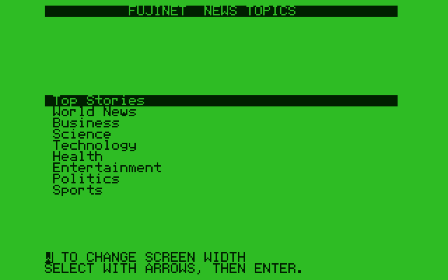

**FujiNet News** connects to a web server that aggregates news stories from multiple sources. Pick a topic, scroll through headlines, and read full articles — all on your CoCo.

- CoCo 1 & 2: supports 32-column and 42-column (with real lowercase) display
- CoCo 3: also supports native 40- and 80-column modes

**Location:** `tnfs.fujinet.online/COCO/NEWS.DSK`

### Weather

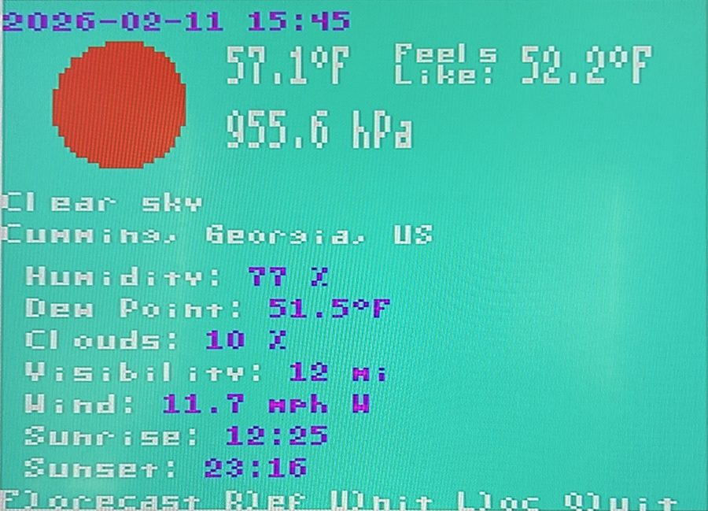

**FujiNet Weather** retrieves current conditions and forecasts from a free web service. Your location is detected from your FujiNet's IP address automatically, or you can enter any location manually. Toggle between Imperial and Metric units and refresh at any time.

**Location:** `tnfs.fujinet.online/COCO/WEATHER.DSK`

### Netcat

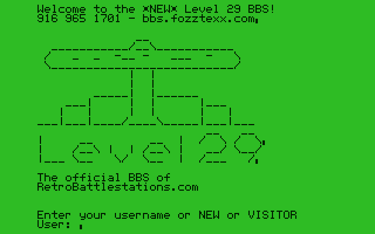

**FujiNet Netcat** is a simple terminal program for telnetting to online BBSes and other Telnet services. Connect using the URL format:

```
N:TELNET://MYBBSEXAMPLE.COM:PORT
```

Uses a 42-character soft font with **VT-52** (monochrome) compatibility. If your favorite BBS supports VT-52 terminal emulation, use Netcat for the best experience.

**Location:** `tnfs.fujinet.online/COCO/NETCAT.DSK`

### Wiki

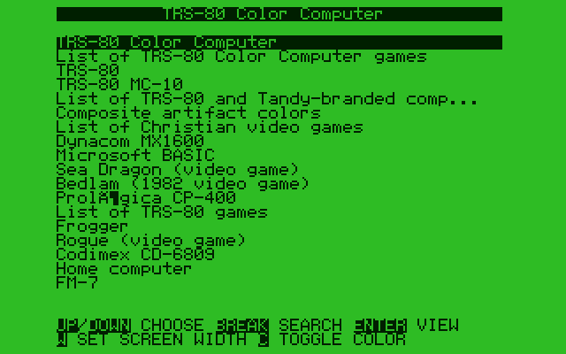

**FujiNet Wiki** searches Wikipedia. Enter a subject, select from the results, and read full articles on your CoCo.

- CoCo 1 & 2: 42-column upper/lowercase soft font
- CoCo 3: also supports native 40/80 column formats

**Location:** `tnfs.fujinet.online/COCO/WIKI.DSK`

---

## Chapter 6 — Appendix

### Firmware updates

FujiNet firmware is updated using the **FujiNet-Flasher** tool.

**Requirements:**
- USB-A to USB-mini cable
- Silicon Labs CP210x USB bridge driver — download from
  [silabs.com](https://www.silabs.com/software-and-tools/usb-to-uart-bridge-vcp-drivers?tab=downloads)
  (Windows: right-click `silabser.inf` → Install)
- [FujiNet-Flasher](https://github.com/FujiNetWIFI/fujinet-flasher/releases) for your OS

**Flashing steps:**

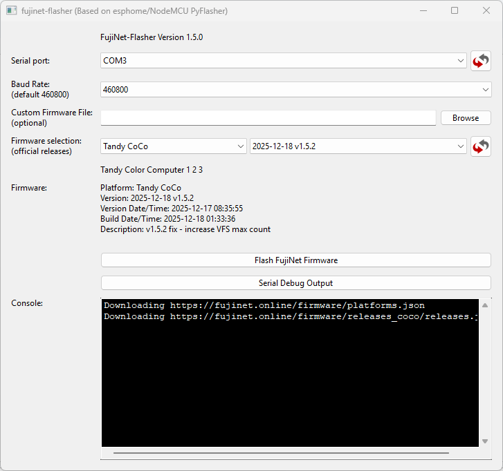

1. **Power down** your CoCo.
2. Connect the USB cable between your PC and FujiNet.
3. Open FujiNet-Flasher.
4. Select the **serial port** (usually only one listed).
5. Leave baud rate at **460800**.
6. Select **Tandy CoCo** from the firmware dropdown, then choose the firmware version (use the latest).
7. Click **Flash FujiNet Firmware**.
8. Hold down the **A button** on your FujiNet (the one closest to the front) until the flashing process starts writing — then release.
9. Once complete, **disconnect the USB cable** before powering up your CoCo.

!!! warning "Nightly builds"
    Nightly/pre-release builds are available at [github.com/FujiNetWIFI/fujinet-firmware/releases/tag/nightly](https://github.com/FujiNetWIFI/fujinet-firmware/releases/tag/nightly) — look for files starting with `fujinet-COCO`. These are provided **AS-IS** with no guarantee they will work. Only use them if you're prepared to troubleshoot on your own.

### Debug logging

To view FujiNet's debug log:

1. Connect the USB cable.
2. Open FujiNet-Flasher.
3. Click **Serial Debug Output**.

You'll see live debug messages as your CoCo accesses FujiNet.

### TNFS

TNFS is the file server protocol FujiNet uses to stream disk images over the internet. You can run your own local TNFS server to access software on your PC, Mac, or Linux server.

Setup guide: [github.com/FujiNetWIFI/fujinet-firmware/wiki/Setting-up-a-TNFS-Server](https://github.com/FujiNetWIFI/fujinet-firmware/wiki/Setting-up-a-TNFS-Server)

### Software development in C for FujiNet

To write CoCo software that uses FujiNet, you'll need:

| Tool | Link |
|---|---|
| **CMOC** C compiler | [CMOC homepage](http://gvlsywt.cluster051.hosting.ovh.net/dev/cmoc.html) |
| **LWTools** assembler/linker | [lwtools.ca](https://www.lwtools.ca) |
| **Color Computer Toolshed** (disk image utilities) | [GitHub](https://github.com/nitros9project/toolshed/releases) |
| **fujinet-lib** (C library for FujiNet) | [GitHub](https://github.com/FujiNetWIFI/fujinet-lib) |
| **MekkoGX** build system (cross-platform Makefiles) | [GitHub](https://github.com/fozztexx/MekkoGX) |

!!! tip
    It's highly recommended to do all FujiNet development in **Linux** or a Linux VM. Ask questions in the `#development` channel on [Discord](https://discord.gg/7MfFTvD).

### Resources and community links

| Resource | Link |
|---|---|
| FujiNet website | [fujinet.online](https://fujinet.online) |
| FujiNet firmware wiki | [github.com/FujiNetWIFI/fujinet-firmware/wiki](https://github.com/FujiNetWIFI/fujinet-firmware/wiki) |
| Facebook users group | [facebook.com/groups/fujinetusers](https://www.facebook.com/groups/fujinetusers) |
| Discord server | [discord.gg/7MfFTvD](https://discord.gg/7MfFTvD) |

---

*Revision: 2026-03-02 · Converted to FujiNet mkdocs documentation site.*
