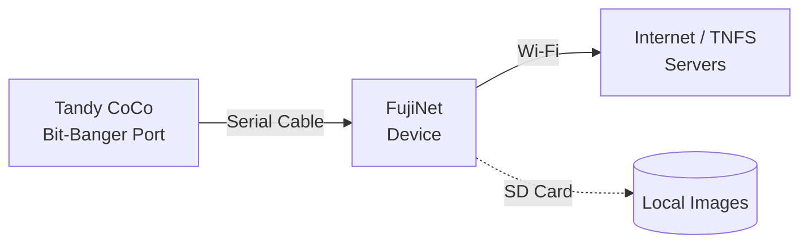

# Getting Started: Tandy Color Computer (CoCo)

FujiNet support for the Tandy Color Computer family is an exciting and growing platform. The CoCo connects via the **Bit-Banger** (RS-232 serial) port or **DriveWire** protocol.

!!! note "Growing platform"
    The CoCo port of FujiNet is newer than the Atari and Apple II implementations. The software library is actively expanding. Expect some rough edges and check the [FujiNet Discord](https://discord.gg/7MfFTvD) for the latest news.

## Compatible computers

| Computer | Notes |
|---|---|
| TRS-80 Color Computer 1 | Bit-Banger port |
| TRS-80 Color Computer 2 | Bit-Banger port |
| TRS-80 Color Computer 3 | Bit-Banger port (enhanced) |

## What you need

- [x] FujiNet for CoCo (Bit-Banger / DriveWire variant)
- [x] Appropriate serial cable for your CoCo model
- [x] Your CoCo computer
- [x] Wi-Fi password for your 2.4 GHz network
- [x] microSD card (FAT32, optional)

## Connection diagram



## Step 1: Connect the hardware

1. **Power off** your CoCo.
2. Plug the FujiNet's cable into the **Bit-Banger** (RS-232) port on the CoCo's rear.
3. Insert a microSD card if you have one.

## Step 2: Wi-Fi setup

1. Power on your CoCo — FujiNet also powers on.
2. If first-time setup, FujiNet broadcasts **`FujiNet-XXXXXX`**.
3. Connect a phone or laptop to **`FujiNet-XXXXXX`** and open **`http://192.168.4.1`**.
4. Enter your Wi-Fi credentials and click **Save**.

## Step 3: Load CONFIG

On CoCo, CONFIG is loaded as a BASIC or machine-language program:

```
CLOAD
```

Or from a disk image:
```
LOADM"CONFIG"
EXEC
```

!!! tip "Full CONFIG guide"
    See **[Using CONFIG — CoCo](../config/coco.md)** for a complete walkthrough.

## Step 4: Mount a disk image

1. In CONFIG, go to **Hosts & Devices**.
2. Browse a TNFS server or SD card.
3. Select a `.DSK` image file.
4. Mount it and exit CONFIG.
5. Boot or reset to load the image.

## Troubleshooting

| Symptom | Likely cause | Fix |
|---|---|---|
| No response from FujiNet | Cable or baud rate mismatch | Verify cable pinout; check baud rate settings |
| CONFIG won't load | Bit-Banger not initialized | Check CoCo BASIC `POKE` settings for serial initialization |
| Intermittent connection | Loose cable | Ensure the Bit-Banger connector is fully seated |

## Next steps

- **[Using CONFIG on CoCo](../config/coco.md)**
- **[TNFS File Servers](../features/tnfs.md)**
- **[Games](../games/index.md)** — cross-platform multiplayer available
