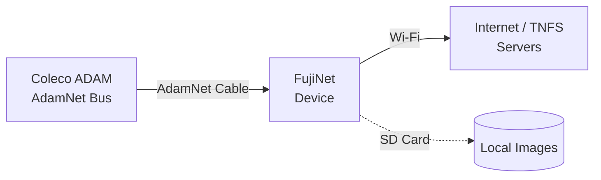

# Getting Started: Coleco ADAM

FujiNet for the Coleco ADAM connects via the **AdamNet** peripheral bus — the same daisy-chainable bus used by the ADAM's tape drives and printers.

## Compatible hardware

| System | Notes |
|---|---|
| Coleco ADAM (standalone) | AdamNet port on rear |
| ADAM expansion for ColecoVision | AdamNet port on expansion module |

## What you need

- [x] FujiNet for Coleco ADAM (AdamNet variant)
- [x] AdamNet cable (usually included)
- [x] Your ADAM computer or ColecoVision + ADAM expansion
- [x] Wi-Fi password for your 2.4 GHz network
- [x] microSD card (FAT32, optional)

## Connection diagram

!!! info "AdamNet is daisy-chainable"
    Like Atari SIO, the AdamNet bus chains multiple devices together. FujiNet integrates alongside your existing tape drives and keyboard controller.

## Step 1: Connect the hardware

1. **Power off** your ADAM.
2. Connect the FujiNet's AdamNet cable to the **AdamNet port** on the rear of the ADAM.
3. If chaining other AdamNet devices, connect them from FujiNet's second port.
4. Insert a microSD card if you have one.

!!! warning "Power off before connecting"
    Always power off before connecting or disconnecting AdamNet devices.

## Step 2: Wi-Fi setup

1. Power on your ADAM.
2. If this is first-time setup, FujiNet broadcasts **`FujiNet-XXXXXX`**.
3. Connect a phone or laptop to **`FujiNet-XXXXXX`** and open **`http://192.168.4.1`**.
4. Enter your Wi-Fi credentials and click **Save**.

## Step 3: Access CONFIG

FujiNet presents a CONFIG disk image that loads automatically on boot:

1. Power on (or reset) your ADAM — FujiNet presents the CONFIG disk.
2. Navigate the CONFIG menus to set up disk images and network settings.

!!! tip "Full CONFIG guide"
    See **[Using CONFIG — Coleco ADAM](../config/coleco-adam.md)** for a complete walkthrough.

## Step 4: Mount a disk image

1. In CONFIG, go to **Hosts & Devices**.
2. Browse an online TNFS server or your SD card.
3. Select a `.ddp` (digital data pack) or `.dsk` image.
4. Assign it to a drive and exit CONFIG.
5. Reset the ADAM to boot the mounted image.

## Troubleshooting

| Symptom | Likely cause | Fix |
|---|---|---|
| ADAM shows tape error on boot | FujiNet not powering on | Check AdamNet cable; verify FujiNet has power |
| CONFIG won't load | AdamNet ID conflict | Disconnect other AdamNet devices and retry |
| Can't reach TNFS servers | Wi-Fi not configured | Reconfigure via the `FujiNet-XXXXXX` hotspot |

## Next steps

- **[Using CONFIG on Coleco ADAM](../config/coleco-adam.md)**
- **[TNFS File Servers](../features/tnfs.md)**
- **[Games](../games/index.md)** — including cross-platform multiplayer
