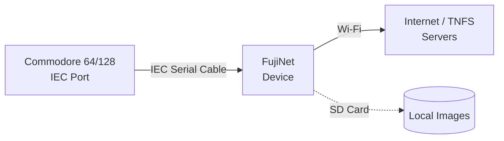

# Getting Started: Commodore 64

FujiNet for Commodore machines connects via the **IEC serial bus** — the same bus used by the 1541, 1571, and 1581 disk drives.

## Compatible computers

| Computer | Notes |
|---|---|
| Commodore 64 | IEC port on rear |
| Commodore 128 | IEC port on rear |
| Commodore VIC-20 | IEC port on rear |

## What you need

- [x] FujiNet for Commodore (IEC variant)
- [x] IEC cable (usually included)
- [x] Your Commodore computer
- [x] Wi-Fi password for your 2.4 GHz network
- [x] microSD card (FAT32, optional)

## Connection diagram



!!! info "IEC device addresses"
    The IEC bus supports multiple devices with addresses 8–15. FujiNet defaults to **device 8** (the primary drive address). If you have a real 1541 on device 8, configure FujiNet to use a different address via CONFIG.

## Step 1: Connect the hardware

1. **Power off** your Commodore.
2. Plug the IEC cable into the **IEC port** on the rear of the C64.
3. Plug the other end into FujiNet's IEC port.
4. Chain additional IEC devices (real drives, printers) from FujiNet's second IEC port if needed.
5. Insert a microSD card if you have one.

!!! warning "Power off before connecting"
    Always power off before connecting or disconnecting IEC devices.

## Step 2: Wi-Fi setup

1. Power on your Commodore — FujiNet also powers on.
2. If this is first-time setup, FujiNet broadcasts **`FujiNet-XXXXXX`**.
3. Connect a phone or laptop to **`FujiNet-XXXXXX`** and open **`http://192.168.4.1`**.
4. Enter your Wi-Fi credentials and click **Save**.
5. FujiNet reboots and connects to your home network.

## Step 3: Load CONFIG

On Commodore, CONFIG is loaded as a program from the emulated drive:

```
LOAD"CONFIG",8,1
RUN
```

Or if your keyboard is set up with the FujiNet auto-boot disk:

1. Turn on your C64 — FujiNet presents the CONFIG disk automatically.
2. The CONFIG program loads and displays the main menu.

!!! tip "Full CONFIG guide"
    See **[Using CONFIG — Commodore 64](../config/commodore-64.md)** for a complete walkthrough.

## Step 4: Mount a disk image

1. In CONFIG, go to **Hosts & Devices**.
2. Browse an online TNFS server or your SD card.
3. Select a `.D64`, `.D71`, or `.D81` image.
4. Mount it to device 8 (or another device number).
5. Exit CONFIG.

```
LOAD"*",8,1
RUN
```

## Troubleshooting

| Symptom | Likely cause | Fix |
|---|---|---|
| `?DEVICE NOT PRESENT ERROR` | FujiNet not on device 8 | Check device address in CONFIG |
| Long load times | Normal IEC speed | FujiNet supports standard IEC speed; consider JiffyDOS |
| Can't see TNFS servers | Wi-Fi not configured | Reconfigure via `FujiNet-XXXXXX` hotspot |

## Next steps

- **[Using CONFIG on Commodore 64](../config/commodore-64.md)**
- **[TNFS File Servers](../features/tnfs.md)**
- **[Games](../games/index.md)** — including cross-platform multiplayer
