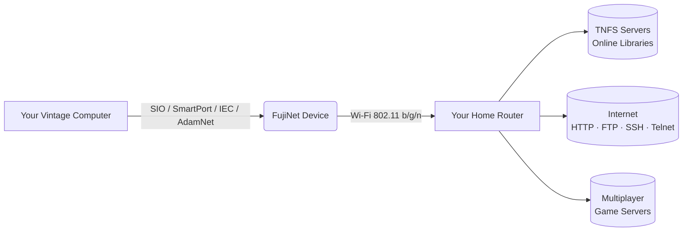
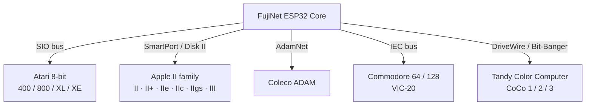
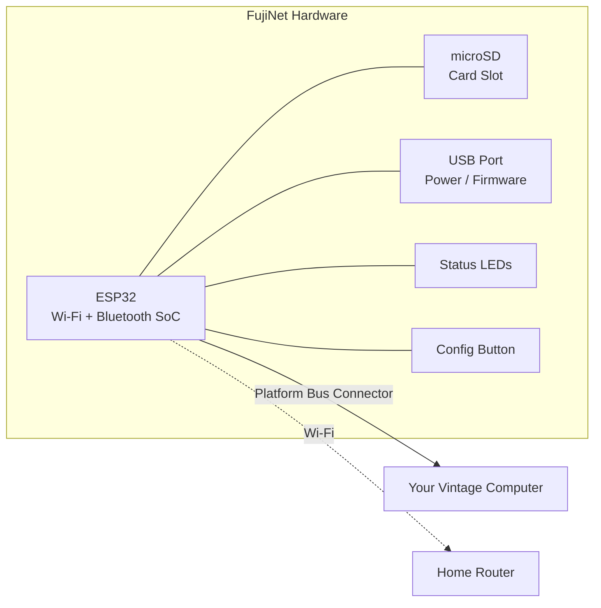

# What is FujiNet?

## The elevator pitch

Think of FujiNet as a **Gotek drive — but over Wi-Fi**.

A Gotek lets you plug a USB stick full of disk images into your vintage computer and load software without physical floppy disks. FujiNet goes further: it connects your vintage computer to the internet so you can browse **curated online libraries** of software the moment you power on. No USB sticks to update. No "sneaker-net" (carrying disks around). Just your retro machine, online.

## What FujiNet replaces

One FujiNet device simultaneously emulates hardware that used to require multiple separate peripherals:

| Emulated hardware | What it does |
|---|---|
| Disk drive(s) | Mount `.ATR`, `.DSK`, `.D64`, `.DSK`, `.dmg` images from SD card or network |
| Cassette / tape drive | Load software from `.CAS` tape images |
| Modem | Dial in to BBSes via Telnet |
| Printer | Capture printer output to PDF on your computer |
| Real-time clock | Provide the current date and time to the computer |
| SAM speech | Text-to-speech synthesis (Atari) |

## The Network Device — the magic ingredient

Beyond peripheral emulation, FujiNet adds something no peripheral emulator ever offered: a **Network Device** (called `N:` on Atari, and equivalent on other platforms).

Your vintage CPU — running at 1–2 MHz — can't handle TCP/IP packet processing. FujiNet's onboard ESP32 chip handles all the heavy networking so your retro machine just reads and writes data as if it were talking to a serial port.

Protocols supported over the network device:

- HTTP and HTTPS
- FTP
- SSH
- Telnet
- TNFS (Trivial Network File System — purpose-built for retro access to file servers)
- WebDAV
- TCP and UDP sockets
- JSON parsing

This unlocks applications that would be impossible without FujiNet: weather clients, Wikipedia readers, global high-score tables, and cross-platform multiplayer games.

## Supported platforms

FujiNet currently supports five vintage computer families, each connected via the machine's native peripheral bus:

Each platform connects via its **native bus** — no modifications to your computer are required.

## Hardware overview

- **ESP32** — The brain. Handles Wi-Fi, peripheral emulation, and the network device.
- **microSD slot** — Store disk images locally (FAT32 format).
- **USB port** — For firmware updates and optional external power.
- **Status LEDs** — Show disk and network activity at a glance.
- **Config button** — Force the device into Wi-Fi setup mode.

## 100% open source

FujiNet is a community project. All firmware, hardware designs, and software are open source and available on [GitHub](https://github.com/FujiNetWIFI). Anyone can contribute, and the project welcomes new platforms, new apps, and documentation improvements.

## Where to go next

- **[Get started](getting-started/index.md)** — Connect your FujiNet and get online in minutes
- **[Features](features/index.md)** — Deep-dive into disk drives, networking, and more
- **[Apps](apps/index.md)** — Discover what you can run
- **[Games](games/index.md)** — Find multiplayer and high-score games
